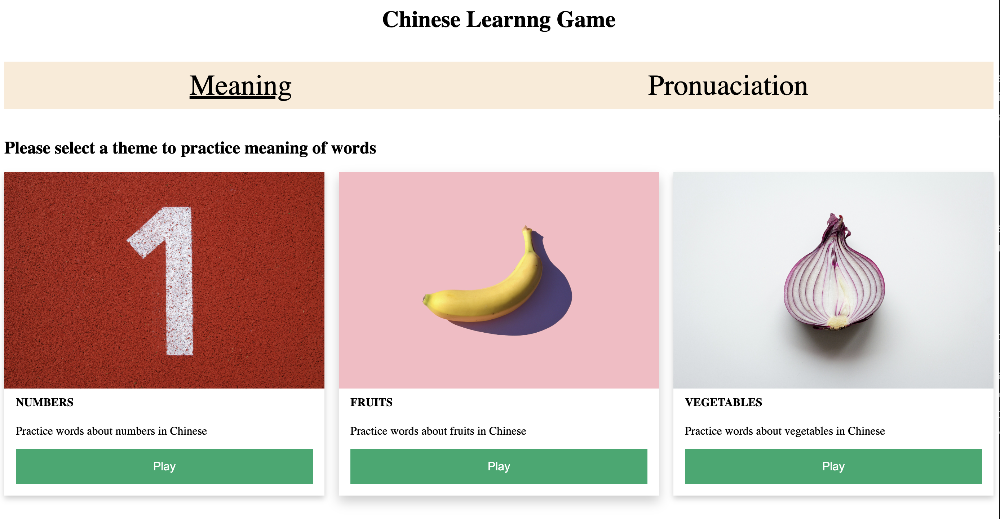
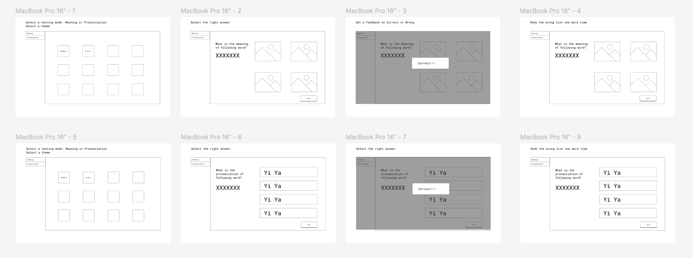

# Game Introdution

### Game inspiration:
This is a game is inspired by a firend of the developer who is learning Chinese during leisure time, and this friend always complaining about the current Language learning games aren't good enough. This inspried the developer to build a game to help their friend out! This game is designed for **Beginning-level** Chinese Leaner. 

### Game summary:
This game will help users practice their understanding of Chinese characters **Meaning** and **Pronunciation**.

#### Under Meaning mode:

* The dafault landing page is Meaning page
* Users can select a theme to play *(numbers, fruits, vegetables, etc.)*  
* For each round users will have 10 quizes, for each quiz, users will see a chinese word and 4 options of the meaning of the Chinese word. They need to select the correct one.  
* After they select the answer, there will be message pop up to let them know if they are correct or wrong for each quiz.
* After first round, the will have the options to redo the wronged quizes, go to the next level or go back to home page.

#### Under Pronunciation mode:

* Users will need to navigate to Pronunciation page usng the navigation tabs.
* Users can select a theme to play *(numbers, fruits, vegetables, etc.)*  
* For each round users will have 10 quizes, for each quiz, users will see a chinese word and 4 options of the pronunciation of the Chinese word. They need to click on the play audio button to hear each option, and make a selection.
* After they select the answer, there will be message pop up to let them know if they are correct or wrong for each quiz.
* After first round, the will have the options to redo the wronged quizes, go to the next level or go back to home page.

#### Win Condition:
* For each round of quiz there will be 10 quizes and users need at least have **6 out 10** (60% correct rate) in order to "win". 

* Only if they "win", they can move to next level, otherwise they have to redo the wrong ones or go back to home page and come back later

### User story:
#### Andrew as the user:
* He wants to practice on his Chinese 
* He chose to study the meaning of Chinese words and select the mode
* He wanted to select a specific theme that he can practice on, which is Number 
* He go through the first 10 tasks generated under number
* He got 5/5 correct, which was identified as “Lose”
* He wanted to practice the wong works again 
* He then got 10/10 correct, he was able to unlock the next level
* Days later, he came back and wanted to see all the words he got wrong before and practice on them. He selected the “Redo List” theme to practice on all the words he got wrong before **(Out of MVP scope)**

#### John as the user:
* He wants to practice on his Chinese’s pronunciation  
* He chose to study the pronunciation of Chinese words and select the mode
* He wanted to select a specific theme that he can practice on, which is Fruits for this time
* He go through the first 10 tasks generated under Fruits
* He got 6/10 correct, which was identified as “Win”
* He is able to move to next level
* But, he wanted to practice the wong works again, so he redo the words he got wrong **(Out of MVP scope)**
* Days later, he came back and wanted to see all the words he got wrong before and practice on them. He selected the “Redo List” theme to practice on all the words he got wrong before **(Out of MVP scope)**

### Design:
#### Low-fi Mocks:

##### [Design Figma link](https://www.figma.com/design/TG2Q4bIzzBqnwHP5Ws6QhV/Browser-based-game-project-Chinese-learning?node-id=0-1&t=unDkxW70gMcfOBpJ-1)

###  Next step: 

* ReDo list funtion is currently o of scope of MVP, but it's halfly implemented, will add it soon. **Stay tuned!!!**

* Generte more rounds of quiz under different themes, for the MVP demo purpose, I only got one round of theme for each theme.

* Refine the UI, as for now the it is not very visually appealling.

###  Other links: 
[GitHub Repo link](https://github.com/Q-TT/browser-based-game-project.git)

[Deployed page link](https://q-tt.github.io/Chinese-learning-browser-based-game-project/)

 